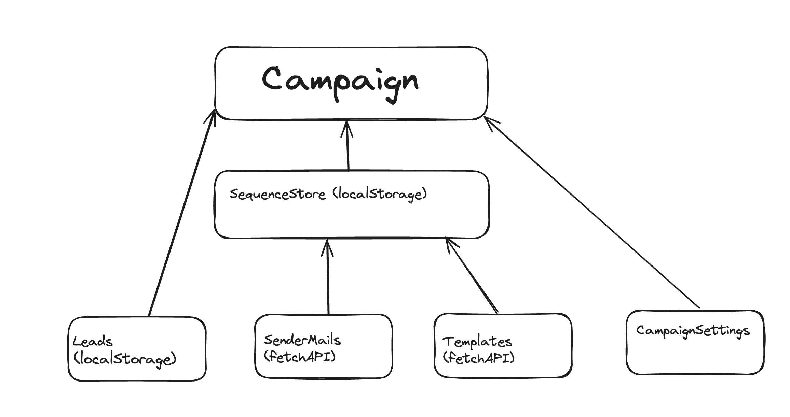

# Getting Started with Create React App

This project was bootstrapped with [Create React App](https://github.com/facebook/create-react-app).

## Available Scripts

In the project directory, you can run:

### `npm start`

Runs the app in the development mode.\
Open [http://localhost:3000](http://localhost:3000) to view it in your browser.

The page will reload when you make changes.\
You may also see any lint errors in the console.

### `npm test`

Launches the test runner in the interactive watch mode.\
See the section about [running tests](https://facebook.github.io/create-react-app/docs/running-tests) for more information.

<!-- ### `npm run build`

Builds the app for production to the `build` folder.\
It correctly bundles React in production mode and optimizes the build for the best performance.

The build is minified and the filenames include the hashes.\
Your app is ready to be deployed!

See the section about [deployment](https://facebook.github.io/create-react-app/docs/deployment) for more information.

### `Documentation`

First, I've changed the pathing to absolute, as long as imports been made with '@/', simply copy pasting the components folder should work without any issues. 

```javascript
jsconfig.json
{
  "compileOnSave": true,
  "compilerOptions": {
    "baseUrl": "./src",
    "paths": {
      "@/*": ["./src/*"]
    }
  },
  "include": ["src"]
}
```

### `Dependencies`

"framer-motion": "^11.2.6", "mini-svg-data-uri": "^1.4.4", 
These are necessary for the dotted background in the home section. 

"sonner": "^1.4.41",
This is the toaster component I've used initially, but react-scripts doesn't support it. For the notifications can be replaced with react-hot-toast(https://react-hot-toast.com/). 

"moment": "^2.30.1", "moment-timezone": "^0.5.45", (https://momentjs.com/)
Moment library has been used for adjusting timezone settings for campaign schedules.

"vaul": "^0.9.1",
This has been installed by shadcn. 

"zustand": "^4.5.2"
State management has been implemented via zustand. Some of store actions probably might replace with database or API calls, but so far sequences, leads, time zone settings etc. all connected via zustand.

### `Folder Structure`

```
src/
├── components/
│   ├── Blocks/
│   │   ├── [Blockname]tabs/
│   │   │     ├──GeneralSettings.jsx
│   │   ├──-- ├──ScheduleSettings.jsx
│   │   ├──-- ├──TrackingSettings.jsx
│   │   │     └── ...
│   │   ├── TemplatesBlock.jsx
│   │   ├── SettigsBlock.jsx
│   │   └── ...
│   │   
│   ├── ui/
│   │   ├── Accordion.jsx
│   │   ├── Button.jsx
│   │   ├── Card.jsx
│   │   ├── DropdownMenu.jsx
│   │   ├── Input.jsx
│   │   ├── Modal.jsx
│   │   ├── Select.jsx
│   │   ├── Table.jsx
│   │   ├── Tabs.jsx
│   │   ├── Textarea.jsx
│   │   ├── Tooltip.jsx
│   │   └── ...
│   ├── LaunchSequenceCard.jsx
│   ├── SequenceSheet.jsx
│   └── ...
├── layout/
│   ├── Header
│   ├── layout.js
│   └── ...
├── data/
│   ├── dummyList.js
│   ├── timeZones.js
├── store/
│   ├── layoutStore.js
│   ├── leadStore.js
│   ├── sequenceStore.js
│   └── ...
├── utils/
│   ├── api.js
│   ├── helpers.js
│   └── ...
├── App.jsx
├── index.jsx
└── ...
```

components/ui is self explanatory, just copy paste them with other shadcn components. I've grouped Dialog menus like Settings, Templates etc under the Block folder. To keep it managable, I've also grouped Dialog tabs under the naming convention [MenuNameBlock]Tabs. By convention, data-table elements should be grouped with pages.jsx in Next.js, since it wouldn't work for react-router I've grouped them under different folders. 

Store keeps all the zustand modules. 

Layout keeps all the layout elements for SPA and hot refresh functionalities. Simply adding header to pages and wrapping them between a higher order div would keep the styling intact. 

data folder keeps timezones and dummyMail list for sender mails. You should replace dummyMail for actual account mails. Leaving timezones intact and importing them to components -> Blocks -> SettingsBlockTabs -> ScheduleSettings
should work.

### `Functionality`
I've designed the components around Zustand state management. I don't know how the backend works so I've tried to keep it simple as possible.  




Each component got separate pages, think it like a three page long form. 

Currently, zustand sequenceStore keeps the tabs on mail sequences, including mails. Normally, I assume you might want to pull that data from db, but for the time being I've used dummyMails from data->dummyList. 

components -> SequenceSheet
```
const OPTIONS = (yourDATA).map((item) => ({
  label: `${item.name} (${item.email})`,
  value: item.email,
  disable: false, (You may change this if you want to disable this option or to put some constraints)
}));
```

layoutStore checks the active SequenceSheet, so it's critical for template use. 

components->Blocks->TemplatesBlock

```
const templateCategories = [
  "Sales",
  "Sell Online Courses",
  "Recruiting",
  "Marketing",
  "Product",
  "Customer Success",
  "Personal",
  "Other",
];

const stockTemplates = [
  {
    category: "Sales",
    title: "Template 1",
    content: "Content 1",
  },
  {
    category: "Sales",
    title: "Template 2",
    content: "Content 2",
  },
  {
    category: "Product",
    title: "Template 2",
    content: "Content 2",
  },
  {
    category: "Product",
    title: "Template 3",
    content: "Content 3",
  },
];
```

I've only added dummy data for stock templates to verify functionality. I'm guessing you are using a relational database, so primary key is category, map function first checks the category then chekcs the title and content.

```
                <Accordion type="single" collapsible>
                  {templateCategories.map((category) => {
                    const templates = stockTemplates.filter(
                      (template) => template.category === category
                    );
                    return (
                      <AccordionItem key={category} value={category}>
                        <AccordionTrigger>
                          {category} ({templates.length})
                        </AccordionTrigger>
                        <AccordionContent>
                          {templates.map((template) => (
                            <Card
                              key={template.title}
                              className="my-2 border border-slate-200"
                            >
                              <CardHeader>
                                <CardTitle>{template.title}</CardTitle>
                              </CardHeader>
                              <CardContent>
                                <p>{template.content}</p>
                              </CardContent>
                              <CardFooter>
                                <Button
                                  variant="outline"
                                  size="sm"
                                  onClick={() => handleTemplateClick(template)}
                                >
                                  Use this template
                                </Button>
                              </CardFooter>
                            </Card>
                          ))}
                        </AccordionContent>
                      </AccordionItem>
                    );
                  })}
                </Accordion>
```
 It functionality is pretty much the same with lemlist. 

LeadList

Components to display leads and filter them uses Shadcn data table component (https://ui.shadcn.com/docs/components/data-table)

I didn't work with CSV's, so kept it simple when adding new mails. I've put a simple regex for adress validation, text area only accepts valid adresses and one adress at a time. 

Launch. 
Launch takes all available data to map related information to the screen. 
```
  const { leads } = useLeadsStore();
  const { sequences } = useSequenceStore();

  console.log(leads, sequences)
```

To check the available data, simply use leads and sequences objects. 

I've left other settings without any functionality, as per design they belong to campaign settings and I don't know how you guys want to use those settings. But settings for schedules etc. are available. I have not included them in a persistent store.  -->